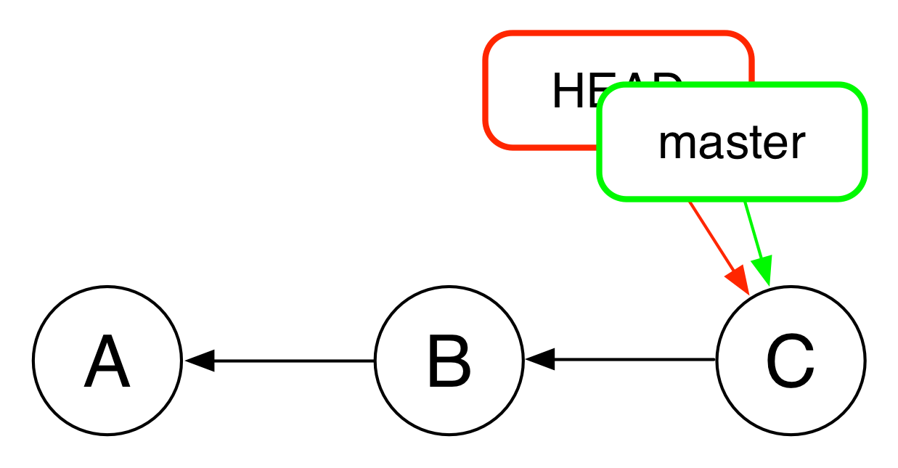

# Gitとは
- レポジトリという形でバージョン管理するためのコマンド


- 上記の.gitディレクトリのことを「レポジトリ」とよぶ
- レポジトリにはプロジェクトのあらゆる過去の状態が主に「コミット」という形で記録されている
- これらの過去の状態を簡単に復元することが可能
- windows, MacOS, Linuxすべてで使える。
- Visual Studioなどの統合環境ではコマンドをいちいち打たなくても中で勝手にコマンドを打ってくれる


# GitとGitHubのちがい
- Gitはコマンドであり、GitHubはGitレポジトリを扱うウェブサービス

# 導入の利点
- アップロード、ダウンロードの処理を気軽におこなえる
  - これまではファイルのアイコンをドラッグ＆ドロップして操作していたが、gitを導入することでコマンド入力やIDE環境ではクリックひとつで可能になる。
- ソフトウェアソースだけでなく、ビジネス文書の管理もはかどる。
- 複数人で開発しているときに混乱しない
  - これまで起こったこと。
  1. プロジェクト名に更新日時を併記することでバージョンが管理されているため、サーバーが似たようなディレクトリが溢れて混乱している。
  2. 複数人がそれぞれ少しずつ修正しているので、開発の歴史が追えない。
  3. 現在のデバイスに焼かれているソフトウェアのバージョンがどれかわからない。
  4. 複数のデバイスでそれぞれ微妙に異なるバージョンが焼かれていて管理できない。
  5. PCソフトとRXソフトの連携がとれず、どれが正しく機能する組み合わせかわからない。
　- gitで全部解決


# 導入の欠点
- 学習コストが高い
- 中途半端な導入は余計にコストがかかる


# 重要概念３つ
## 1.commit


- コミットはプロジェクトの特定の状態を記録したもの
- コミットはハッシュ値で管理される
- すべてのコミットには親コミットがひとつだけ存在する。
- コミットは自分の親のハッシュ値を記録している。
- 上の例ではコミットA、コミットB、コミットCの順におこなわれている。
- Bは自分の親のAを参照することができる。逆はできない。


## 2.branch


- ブランチはコミットの鎖を表す概念
- ただし実質上は特定のコミットを指し示したもの
- デフォルトはmasterブランチとよばれる
- [参考：Git-のブランチ機能-ブランチとマージの基本](https://git-scm.com/book/ja/v2/Git-%E3%81%AE%E3%83%96%E3%83%A9%E3%83%B3%E3%83%81%E6%A9%9F%E8%83%BD-%E3%83%96%E3%83%A9%E3%83%B3%E3%83%81%E3%81%A8%E3%83%9E%E3%83%BC%E3%82%B8%E3%81%AE%E5%9F%BA%E6%9C%AC)


## 3.HEAD


- HEADは現在自分がチェックアウトしているブランチを指し示すポインタ
- つまり実際はブランチを通じて特定のコミットを指し示している(重要)
- 例外として特定のコミットを直接指し示す場合がある(detached HEADとよばれる状態)
- detached HEADの状態で新たにコミットすると、そのコミットはどのブランチにも属さないため、その後に別のブランチをチェックアウトすると、そのコミットを追えなくなってしまう(誰もが一度はしてしまうミス)

- HEAD~はHEADの1個前のコミットをあらわす
- HEAD~~はHEADの2個前のコミットをあらわす
- HEAD~~~は以下略


# 必須Gitサブコマンド
## git init
- 新規でレポジトリをつくるコマンド
- チームで開発する場合はすでに存在しているので使わない
```bash
cd project
git init
```

## git commit
- 新しくコミットをつくるためのコマンド。最重要コマンド。
```bash
git commit -a -m "コミットに関するコメント"
```

## git log
- HEADから遡ったすべてのコミット情報を概観できるコマンド
```bash
git log -v
```

## git diff
- ２つのコミットのちがいを概観する
- 統合環境を使っている場合はそういうボタンがあるはず
```bash
git diff HEADS              // 現在のディレクトリとHEADとのちがい
git diff 3dal33j dhh3kgg    // コミット3dal33jとコミットdhh3kggのちがい
```

## git branch
```bash
git branch                          // 現在存在しているブランチの一覧を示す
git branch fix-mmcFlag              // HEADに新しいブランチを作る
``` 

## git checkout
- HEADを現在のブランチから別のブランチに移動する
```bash
git checkout master                // 現在のブランチからmasterブランチに移動
git checkout -b fix-mmcFlag        // fix-mmcFlagブランチを新規作成してそこに移動
git checkout ek3hhalf              // ek3hhalfコミットに移動(detached HEAD状態になる)
```


## git reset
- コミットをやりなおす
```bash
git reset HEAD~                  　// 1個前のコミットに戻る(ワーキングディレクトリはそのまま) 
git reset HEAD~~                   // 2個前のコミットに戻る(ワーキングディレクトリはそのまま)
git reset --hard HEAD              // 直前にコミットしてから修正した箇所をすべて破棄する(つまりディレクトリをコミット時の状態にもどす)
```

# よくある使い方
1. masterブランチは常にきれいな状態にしておく
2. 何かしらの機能を修正したいときや追加したいときは専用のブランチを作る
3. 専用のブランチにコミットを追加していく
4. 機能の修正や追加が終わってテストが済んだらmasterブランチにマージする(マージはリモート編で説明)


# その他の大事なこと
- .gitignore
    - ファイルで管理しないファイルを指定。
    - 基本ソースファイルのみ管理するため、ビルドしたときに生成されるファイル群は管理対象から外す
- コミット作成に慣れること
    - 特定の機能の修正だけをコミットしてコメント追記することで、後から管理しやすくなる
- ブランチ間の移動に慣れること
    - たとえばbranch Aとbranch Bで管理対象のファイルが異なった場合どうなるか 
- 最初のうちは、自信のないコマンドを入力する前はプロジェクトディレクトリ自体をコピーしておくと助かる


# リモートレポジトリを使う(複数人で開発)
- git pull
- git push
- git merge