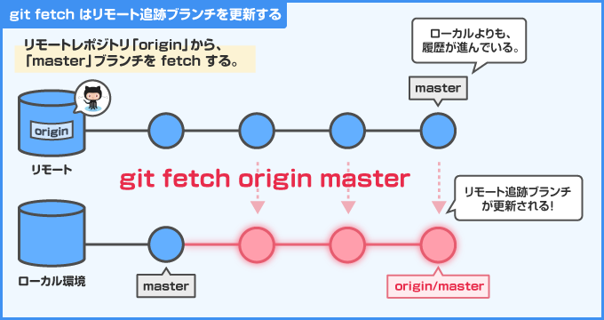
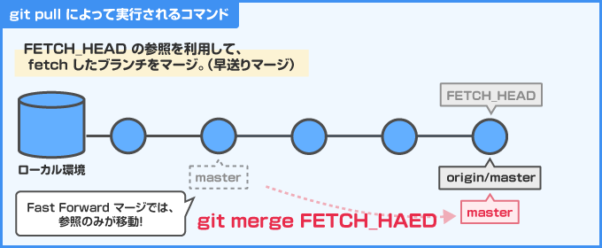
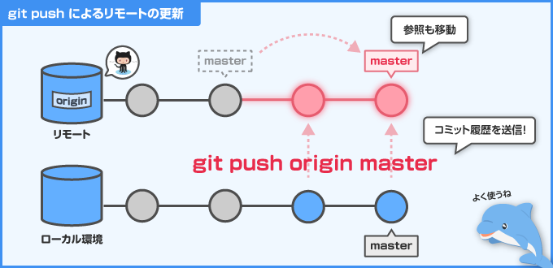
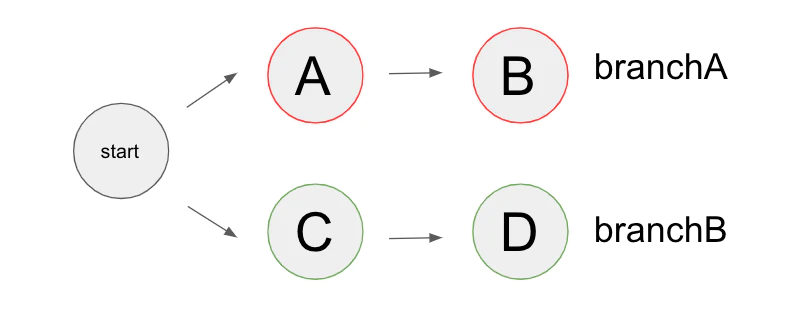
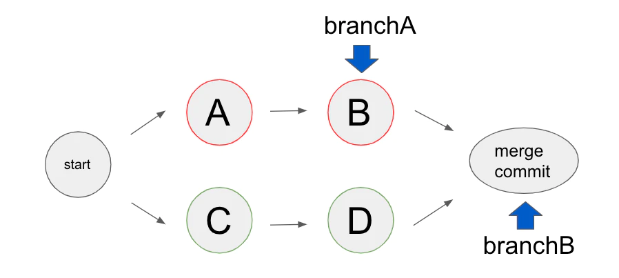
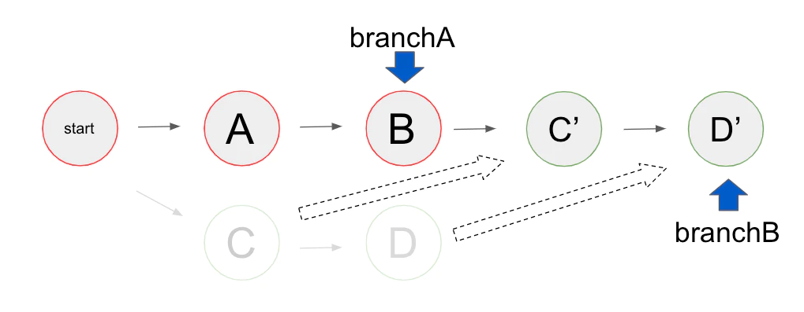

# 複数人で開発
- リモートレポジトリをサーバーに用意する。
- 作業開始時にリモートレポジトリから最新の状態のものをダウンロードしてきてローカルで作業。
- 作業終了時には自分の作業結果をリモートレポジトリにアップロード。


# よくある使い方
1. 1日の作業のはじめにリモートのmasterブランチをローカルにpullする
   ```shell
   git pull origin master
   ```
2. 何かしらの機能を修正したいときや追加したいときは専用のブランチを切る
3. 専用のブランチにコミットを追加していく

4. (翌日)リモートのmasterブランチをローカルにpullする(他の開発者がmasterを更新しているため)
5. 現在自分が開発しているブランチをmasterブランチでリベースする
   ```shell
   git checkout fix-mmc
   git rebase master
   ```

6. 機能の修正や追加が終わってテストが済んだらローカルの専用ブランチをリモートの専用ブランチにpushする
   ```shell
   git push origin fix-mmc
   ```
7. 管理者にmerge requestをおくる
8. requestがacceptされたらローカルの該当ブランチを削除
   ```shell
   git branch -d fix-mmc
   ```

# 重要概念３つ
## origin
- 一番最初にgit clone(後述)したリモートレポジトリの場所をあらわすデフォルトの名前
- そのほかに自分でリモートレポジトリを登録することもできる
```bash
git remote add server https://192.168.1.80/remoteExample.git
```
- 上記の例では社内サーバーのremoteExample.gitにserverという名前をつけている

## コンフリクト

# 必須Gitサブコマンド
## git clone
- 他人のリポートレポジトリを最初に自分のローカルレポジトリに取り込むためのコマンド
```bash
cd Desktop
git clone https://github.com/nikaided/FTLLM
```
- 上記の例ではDesktopにプロジェクトが取り込まれる。
- いちど取り込まれると、そのプロジェクトのoriginが自動でそのリモートレポジトリで登録される
  
```bash
git remote -v
```
- これでoriginのURLを確認できる。


## git pull
- リモートレポジトリのブランチを自分のローカルレポジトリに反映させるためのコマンド




```bash
git pull origin master     // git pull <repository name> <branch name>
```
- 上記の例はoriginがレポジトリ名。masterはブランチ名。
- リモートのブランチ名と同じ名前のローカルブランチが更新される
- 毎回作業のはじめにリモートのマスターブランチをローカルのマスターブランチにダウンロードするために使う
- 細かいことを言うと、git pullは2段階の操作に分かれる
- リモートのブランチとローカルのブランチが競合した場合はめんどうなので、極力ローカルのmasterブランチは自分では更新しないのがよい


## git push
- 自分のローカルレポジトリのブランチをリモートレポジトリに反映させるためのコマンド



```bash
git push origin branch-A    // git pull <repository name> <branch name> 
```
- 上記のコマンド例はoriginがレポジトリ名。branch-Aはブランチ名
- ローカルのブランチ名と同じ名前のローカルブランチが更新される
- 毎回作業の終わりに自分の作業ブランチをリモートレポジトリの同名のブランチをアップロードするために使う
- リモートレポジトリに同じ名前のブランチが存在して、コンフリクトが生じる場合は、pushできない。
- 画像ではマスターブランチをアップロードしているが、基本こういう使い方はしない


## git merge
- あるブランチを別のブランチに併合するためのコマンド
```bash
git checkout branch-B
git merge branch-A
```

- merge前



- merge後



- 主にリモートレポジトリの管理者がpushされてきたブランチをmasterブランチに併合する用途で用いる。
- リモートレポジトリ管理者とはコードの最終責任者(複数人いてもよい)
- コンフリクトがある場合は管理者はマニュアルでそのコンフリクトを解消する。


## git rebase
- あるブランチの履歴を別のブランチを起点に修正するコマンド。

```bash
git rebase master
```

- rebase前
  


- rebase後



- ブランチBの歴史が改変されている。コミットCはC´にコミットDはD´になっている。

- 毎回作業のはじめにリモートからmasterブランチをpullしてくるが、そのmasterの変更を自分の作業ブランチに反映させる必要がある。そのときにrebaseする。
